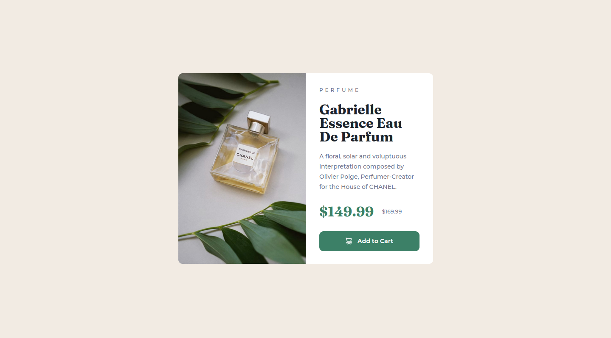

# Frontend Mentor - Product preview card component solution

This is a solution to the [Product preview card component challenge on Frontend Mentor](https://www.frontendmentor.io/challenges/product-preview-card-component-GO7UmttRfa). Frontend Mentor challenges help you improve your coding skills by building realistic projects.

### The challenge

Users should be able to:

- View the optimal layout depending on their device's screen size
- See hover and focus states for interactive elements

### What I Learned

I learned how to use media queries and art direction to make the image responsive. I also researched on the following topics: CSS reset, using EMs vs. REMs, and how to add icon SVGs.

### Links

- Link to live site: [HERE](https://sh0910.github.io/frontend-mentor-solutions/02-product-preview-card-component)

### Screenshot

Desktop screenshot

Mobile screenshot

### Built with

- Semantic HTML5 markup
- CSS custom properties
- Flexbox
- Desktop-first workflow
