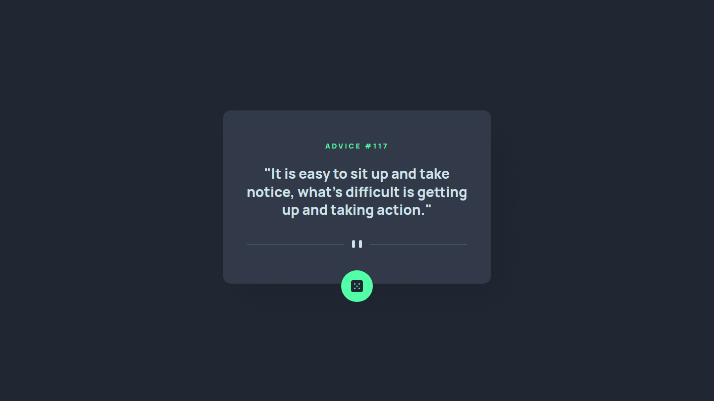
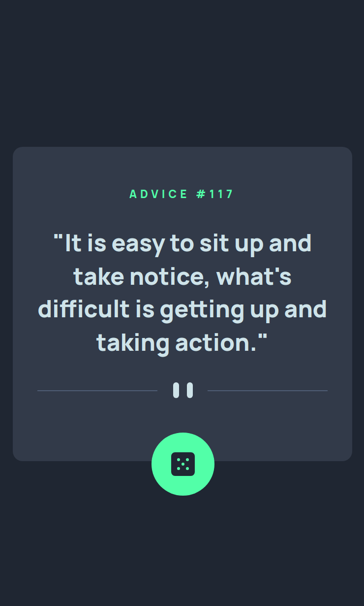

# Frontend Mentor - Advice generator app solution

This is a solution to the [Advice generator app challenge on Frontend Mentor](https://www.frontendmentor.io/challenges/advice-generator-app-QdUG-13db). Frontend Mentor challenges help you improve your coding skills by building realistic projects.

## Overview

### The challenge

Users should be able to:

- View the optimal layout for the app depending on their device's screen size
- See hover states for all interactive elements on the page
- Generate a new piece of advice by clicking the dice icon

### Links

- Live Site URL: [HERE](https://sh0910.github.io/frontend-mentor-solutions/03-advice-generator-app/)

### Screenshot

Desktop

Mobile

## My process

### Built with

- Semantic HTML5 markup
- CSS custom properties
- CSS grid
- Mobile-first workflow

### What I learned

In this project I learned how to use the fetch API, async/await, and DOM manipulation.

### Credits

loader - [Pure CSS Loader](https://loading.io/css/)
