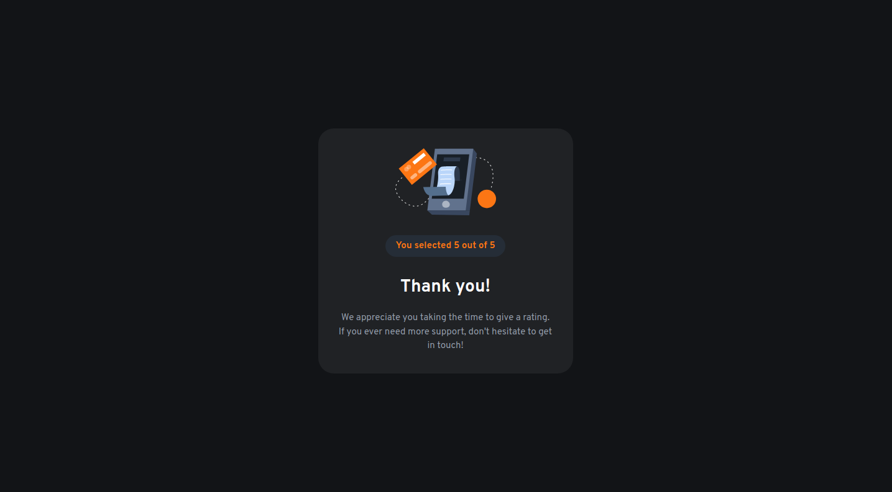

# Frontend Mentor - Interactive rating component solution

This is a solution to the [Interactive rating component challenge on Frontend Mentor](https://www.frontendmentor.io/challenges/interactive-rating-component-koxpeBUmI). Frontend Mentor challenges help you improve your coding skills by building realistic projects.

## Overview

### The challenge

Users should be able to:

- View the optimal layout for the app depending on their device's screen size
- See hover states for all interactive elements on the page
- Select and submit a number rating
- See the "Thank you" card state after submitting a rating

### Links

- Live Site URL: [HERE](https://sh0910.github.io/frontend-mentor-solutions/05-interactive-rating-component/)

### Screenshots

## My process

### Built with

- Semantic HTML5 markup
- CSS custom properties
- Flexbox
- CSS Grid
- Desktop-first workflow

### What I learned

- Semantic HTML for forms
- Styling radio buttons with CSS
- Link HTML form to JavaScript
- Better understanding of CSS Grid

### Useful resources

- [The Odin Project - Form Basics](https://www.theodinproject.com/lessons/node-path-intermediate-html-and-css-form-basics)

- [How do you Submit an HTML Form? How does it work?](https://www.youtube.com/watch?v=TCEgdiN0A8s) - YouTube video from Web Dev Cody that explains how an HTML form submit works.
