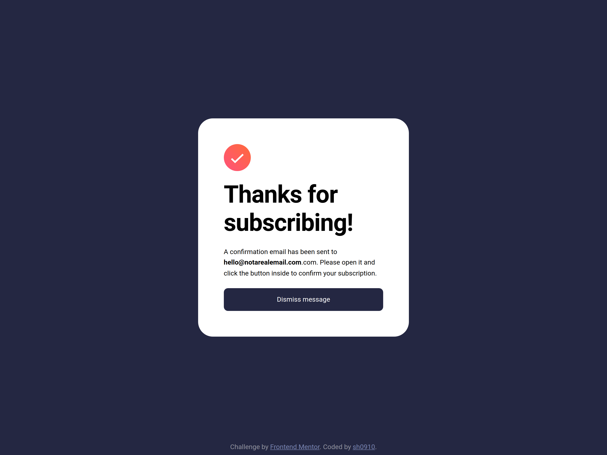

# Frontend Mentor - Newsletter sign-up form with success message solution

This is a solution to the [Newsletter sign-up form with success message challenge on Frontend Mentor](https://www.frontendmentor.io/challenges/newsletter-signup-form-with-success-message-3FC1AZbNrv). Frontend Mentor challenges help you improve your coding skills by building realistic projects.

## Overview

### The challenge

Users should be able to:

- Add their email and submit the form
- See a success message with their email after successfully submitting the form
- See form validation messages if:
  - The field is left empty
  - The email address is not formatted correctly
- View the optimal layout for the interface depending on their device's screen size
- See hover and focus states for all interactive elements on the page

### Links

- Solution URL: [HERE](https://sh0910.github.io/frontend-mentor-solutions/06-newsletter-signup/)
- Live Site URL: [HERE](https://github.com/sh0910/frontend-mentor-solutions/tree/main/06-newsletter-signup)

### Screenshots

Desktop

Mobile

<table>
  <tr>
    <td></td>
    <td></td>
  </tr>
</table>

## My process

### Built with

- Semantic HTML5 markup
- CSS custom properties
- Flexbox
- Desktop-first workflow
- Vanilla JS
