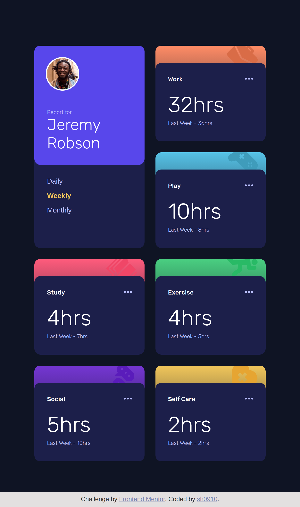

# Frontend Mentor - Time tracking dashboard solution

This is a solution to the [Time tracking dashboard challenge on Frontend Mentor](https://www.frontendmentor.io/challenges/time-tracking-dashboard-UIQ7167Jw). Frontend Mentor challenges help you improve your coding skills by building realistic projects.

## Overview

Users should be able to:

- View the optimal layout for the site depending on their device's screen size
- See hover states for all interactive elements on the page
- Switch between viewing Daily, Weekly, and Monthly stats

## Solution

### Links

- Solution URL: [HERE](https://github.com/sh0910/frontend-mentor-solutions/tree/main/07-time-tracking-dashboard/)
- Live Site URL: [HERE](https://sh0910.github.io/frontend-mentor-solutions/07-time-tracking-dashboard/)

### Screenshots

Desktop screenshot


<table>
  <tr>
    <td>Tablet screenshot</td>
    <td>Mobile screenshot</td>
  </tr>
  <tr>
    <td></td>
    <td></td>
  </tr>
</table>

## My process

### Built with

- Semantic HTML5 markup
- CSS Grid
- SASS
- JavaScript - populating data using JSON file

### What I learned

- In SASS, using the @for loop to iterate through the different background colors for the cards.

```scss
@for $i from 1 through length($card-colors) {
  .card:nth-child(#{$i + 1}) {
    background: linear-gradient(nth($card-colors, $i) 0%, $color-blue-1 100%);
  }
}
```
