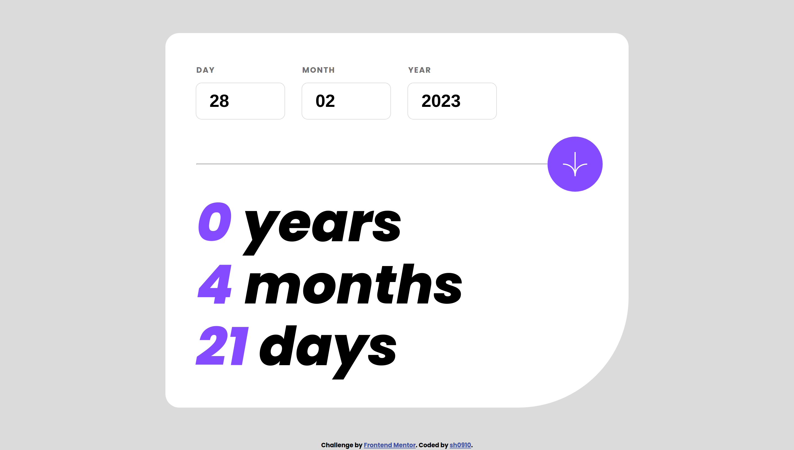
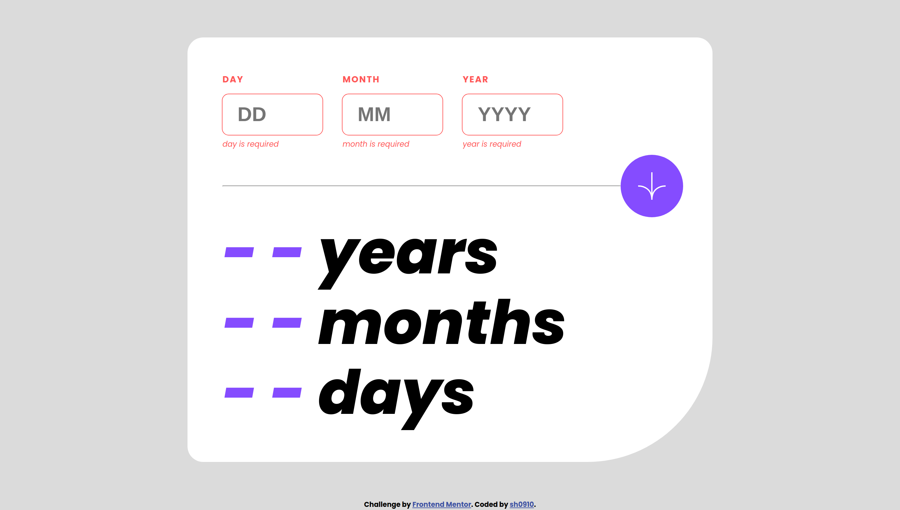
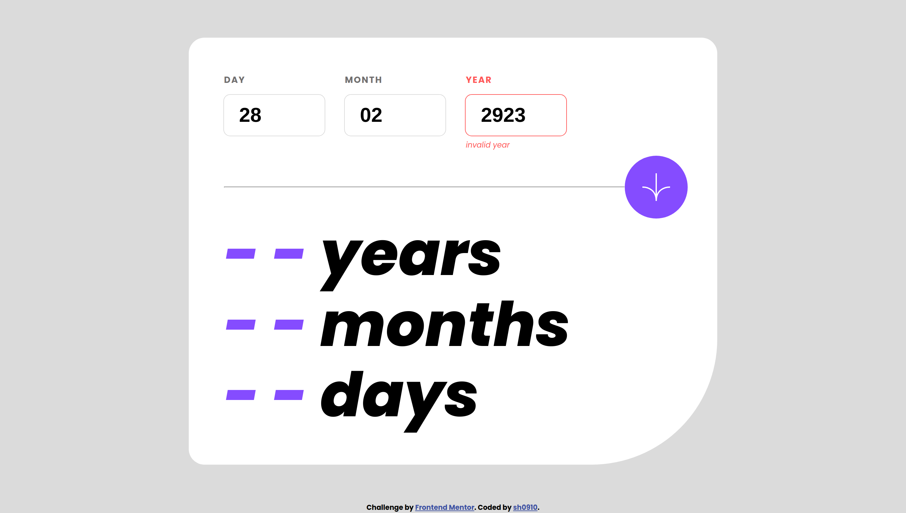
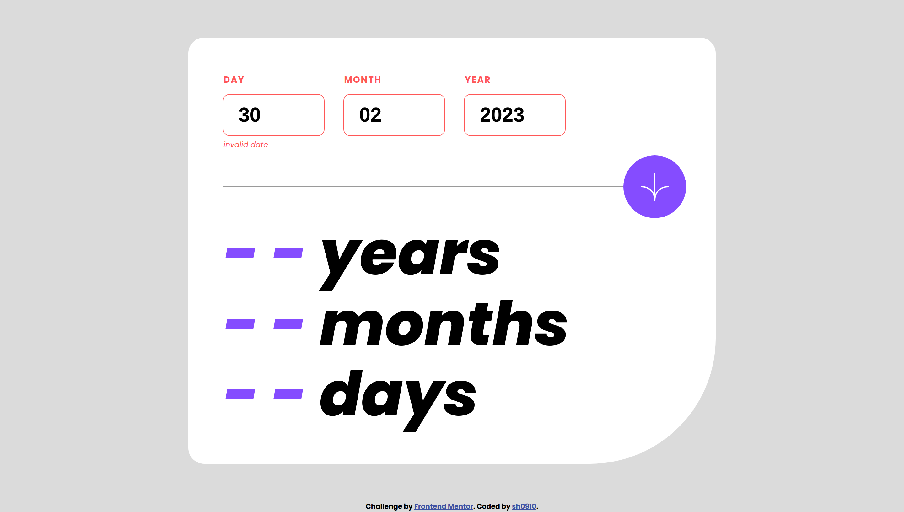
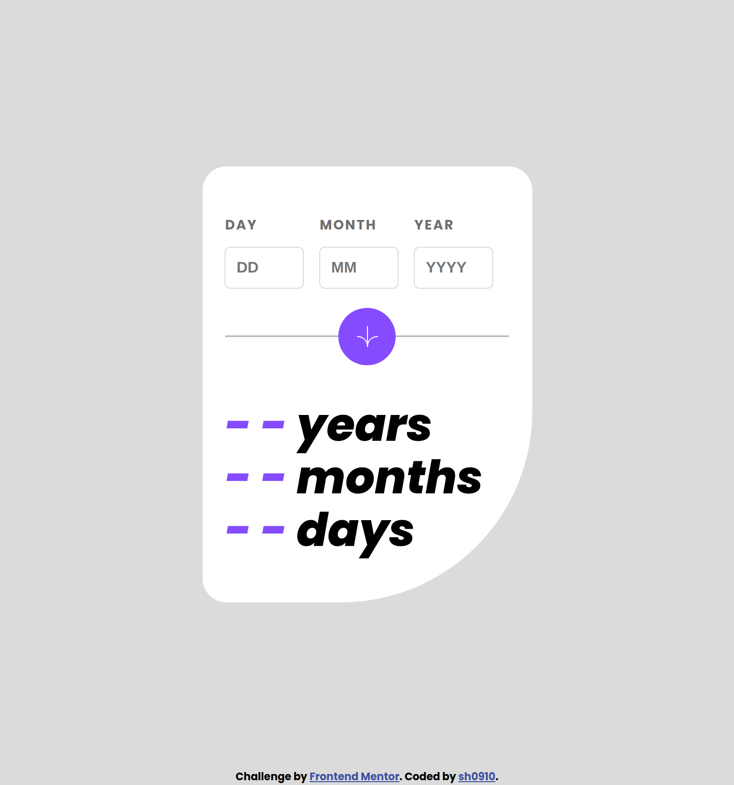

# Frontend Mentor - Age calculator app solution

This is a solution to the [Age calculator app challenge on Frontend Mentor](https://www.frontendmentor.io/challenges/age-calculator-app-dF9DFFpj-Q). Frontend Mentor challenges help you improve your coding skills by building realistic projects.

## Overview

### The challenge

Users should be able to:

- View an age in years, months, and days after submitting a valid date through the form
- Receive validation errors if:
  - Any field is empty when the form is submitted
  - The day number is not between 1-31
  - The month number is not between 1-12
  - The year is in the future
  - The date is invalid e.g. 31/04/1991 (there are 30 days in April)
- View the optimal layout for the interface depending on their device's screen size
- See hover and focus states for all interactive elements on the page
- **Bonus**: See the age numbers animate to their final number when the form is submitted

### Links

- Solution URL: [HERE](https://sh0910.github.io/frontend-mentor-solutions/08-age-calculator-app/)
- Live Site URL: [HERE](https://github.com/sh0910/frontend-mentor-solutions/tree/main/08-age-calculator-app)

### Screenshot

Desktop

Mobile

## My process

### Built with

- Vanilla JS
- ES6 Array methods
- Semantic HTML5 markup
- CSS custom properties
- CSS Grid
- Desktop-first workflow

### What I learned

- JS form validation
- CSS Grid

## Author

- Frontend Mentor - [@sh0910](https://www.frontendmentor.io/profile/sh0910)

## Acknowledgments

- This [solution](https://stackoverflow.com/questions/36179804/javascript-date-allows-invalid-data-e-g-feb-30th) on Stack Overflow on how to validate a date string
