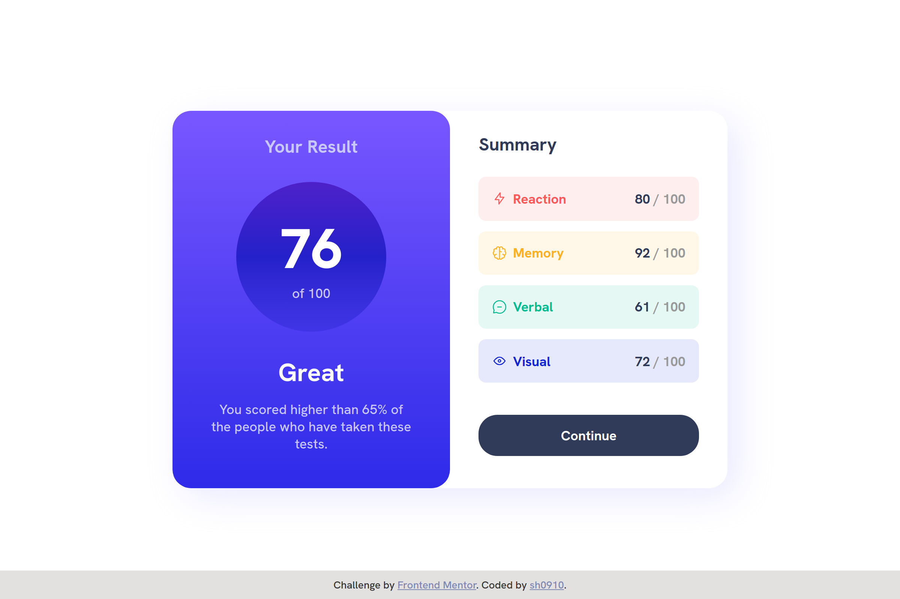

# Frontend Mentor - Results summary component solution

## Welcome! 👋

Thanks for checking out this front-end coding challenge.

[Frontend Mentor](https://www.frontendmentor.io) challenges help you improve your coding skills by building realistic projects.

This is a solution to the [Results summary component challenge on Frontend Mentor](https://www.frontendmentor.io/challenges/results-summary-component-CE_K6s0maV). Frontend Mentor challenges help you improve your coding skills by building realistic projects.

## Overview

### The challenge

Users should be able to:

- View the optimal layout for the interface depending on their device's screen size
- See hover and focus states for all interactive elements on the page
- **Bonus**: Use the local JSON data to dynamically populate the content

### Links

- Solution URL: [HERE](https://github.com/sh0910/frontend-mentor-solutions/tree/main/07-results-summary-component)
- Live Site URL: [HERE](https://sh0910.github.io/frontend-mentor-solutions/07-results-summary-component)

### Screenshot

### Built with

- ES6 Array Methods
- Async/Await
- Semantic HTML5 markup
- CSS custom properties
- Flexbox
- CSS Grid
- Mobile-first workflow
