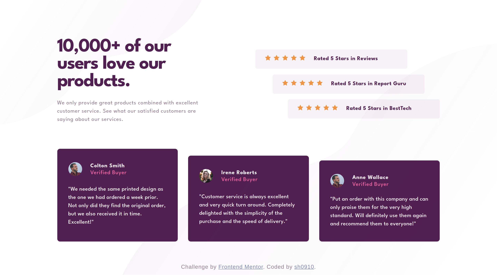

# Frontend Mentor - Social proof section solution

## Welcome! 👋

Thanks for checking out this front-end coding challenge.

This is a solution to the [Social proof section challenge on Frontend Mentor](https://www.frontendmentor.io/challenges/social-proof-section-6e0qTv_bA). Frontend Mentor challenges help you improve your coding skills by building realistic projects.

## Overview

### The challenge

Users should be able to:

- View the optimal layout for the section depending on their device's screen size

### Links

- Solution URL: [HERE](https://github.com/sh0910/frontend-mentor-solutions/tree/main/11-social-proof-section/)
- Live Site URL: [HERE](https://sh0910.github.io/frontend-mentor-solutions/11-social-proof-section/)

### Screenshot

## My process

### Built with

- Semantic HTML5 markup
- CSS custom properties
- Flexbox
- CSS Grid
- Desktop-first workflow
