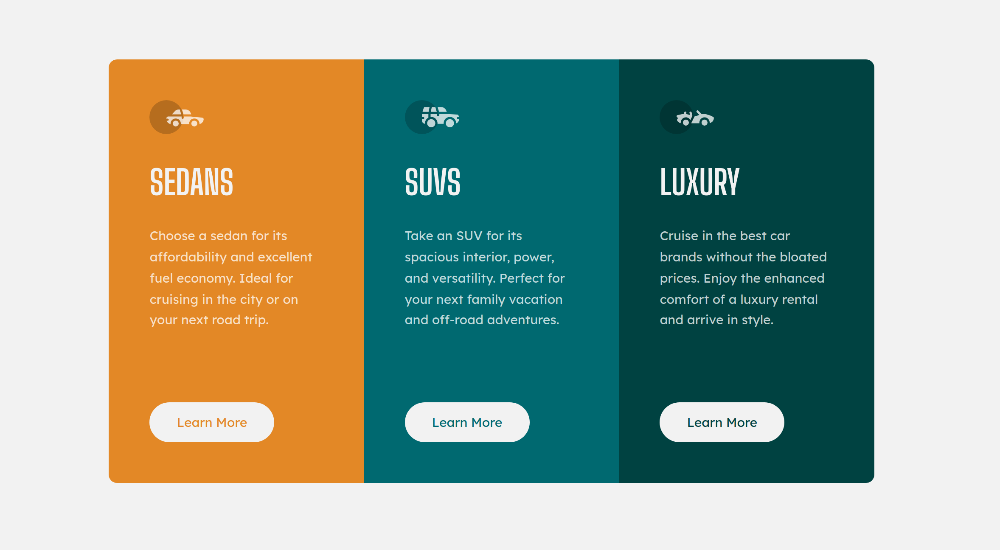

# Frontend Mentor - 3-column preview card component solution

Welcome! 👋 This is a solution to the [3-column preview card component challenge on Frontend Mentor](https://www.frontendmentor.io/challenges/3column-preview-card-component-pH92eAR2-). Frontend Mentor challenges help you improve your coding skills by building realistic projects.

## Overview

### The challenge

Users should be able to:

- View the optimal layout depending on their device's screen size
- See hover states for interactive elements

### Link

- [Live Site URL](https://15-3-column-preview-card.netlify.app/)

### Screenshots

<table style="width: 100%; border-collapse: collapse;">
	<tr>
		<td>Desktop</td>
		<td>Mobile</td>
	</tr>
  <tr>
    <td style="widtht: 80vw; padding: 10px;"></td>
    <td style="width: 12vw; padding: 10px;"></td>
  </tr>
</table>

## My process

### Built with

- Semantic HTML5 markup
- CSS custom properties
- CSS Grid
- [React](https://reactjs.org/) - JS library
