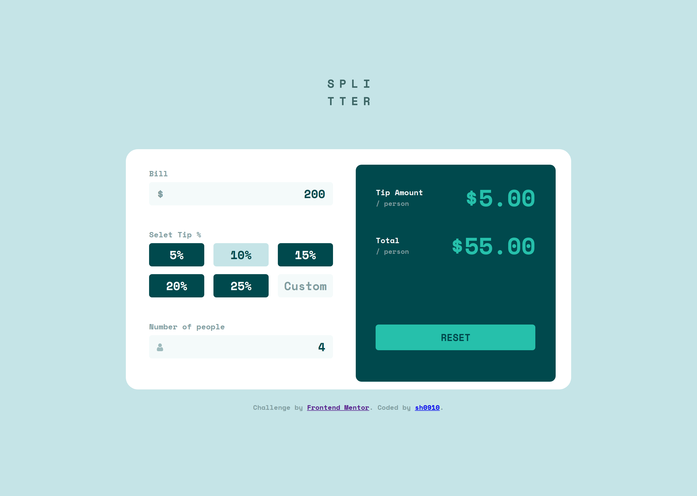
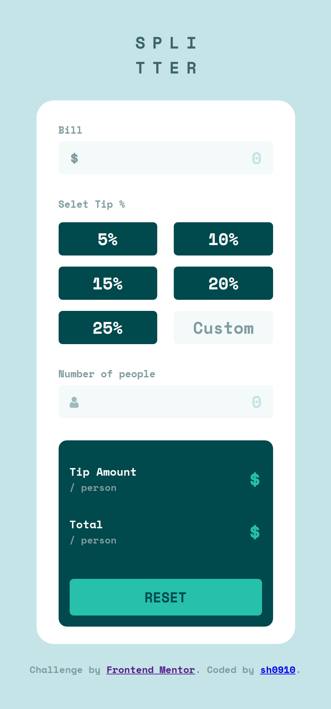

# Frontend Mentor - Tip calculator app solution

Welcome! 👋 This is my solution to the [Tip calculator app challenge on Frontend Mentor](https://www.frontendmentor.io/challenges/tip-calculator-app-ugJNGbJUX). Frontend Mentor challenges help you improve your coding skills by building realistic projects.

## Overview

### The challenge

Users should be able to:

- View the optimal layout for the app depending on their device's screen size
- See hover states for all interactive elements on the page
- Calculate the correct tip and total cost of the bill per person

### Links

- [Live Site URL](https://16-tip-calculator-app.netlify.app/)

### Screenshots

  
  

## My process

### Built with

- [React](https://reactjs.org/) - JS library
- Semantic HTML5 markup
- CSS custom properties
- Flexbox
- Desktop-first workflow

### What I learned

- I am currently learning React, so I built this project using React to reinforce some of the topics that I've learned, such as state lifting, list rendering, and using controlled elements.
