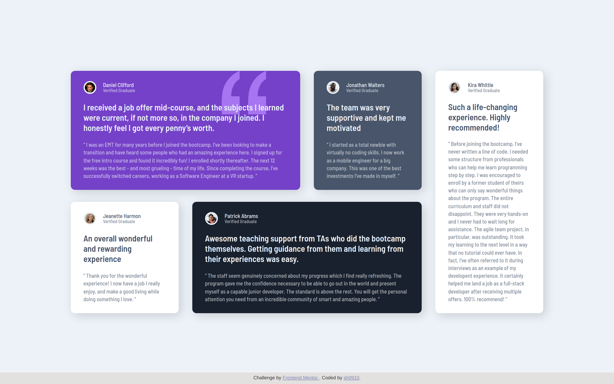

# Testimonials grid section solution

[Live](https://sh0910.github.io/frontend-mentor-solutions/17-testimonials-grid-section/)

### The Challenge

Users should be able to:

- View the optimal layout for the site depending on their device's screen size

### Built with

- Vanilla JavaScript
- Semantic HTML5 markup
- CSS custom properties
- Flexbox
- CSS Grid
- Desktop-first workflow

### What I learned

I built this project to refresh my knowledge of CSS Grid.
