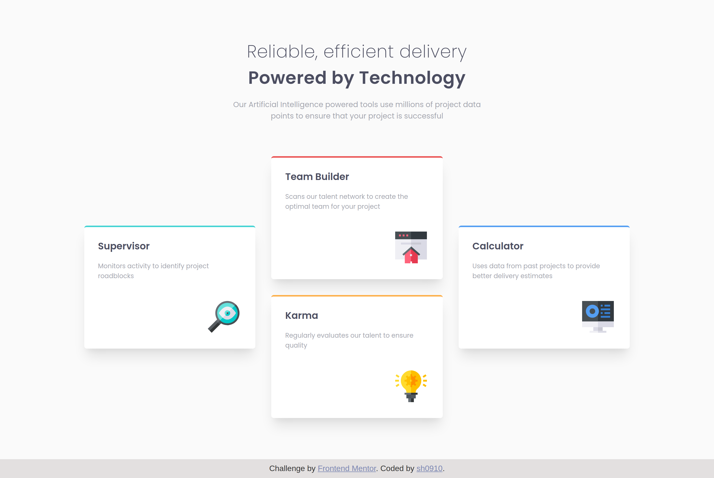

# Four card feature section solution

[Live](https://18-four-card-feature-section.netlify.app/)

### The Challenge

Users should be able to:

- View the optimal layout for the site depending on their device's screen size

### Built with

- React library
- Semantic HTML5 markup
- CSS custom properties
- CSS Grid
- Desktop-first workflow

### What I learned

I built this project to refresh my knowledge of CSS Grid and practice using React library.
